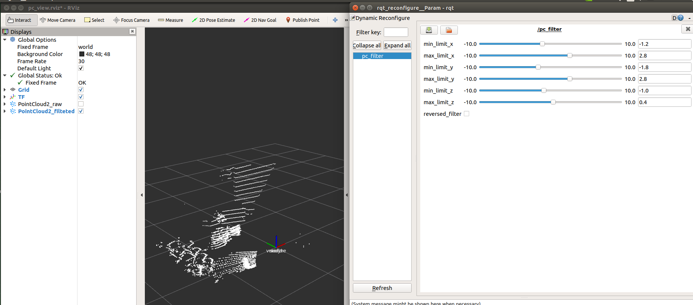

# PointCloud Filter for ROS

This package uses PassThrough filter of PCL for ROS development.

Currently, this package has only been tested on ROS 1 melodic. But ROS 1 noetic sholud also work.



## Build Code SOP

```bash
mkdir ~/pc_filter_ws/src -p
cd ~/pc_filter_ws/src
git clone https://github.com/QQting/pc_filter_ros.git

cd ~/pc_filter_ws
source /opt/ros/melodic/setup.bash
catkin build --cmake-args -DCMAKE_BUILD_TYPE=Release
```

## Run Code SOP

Before runing the code, make sure your pointcloud data is published as the topic named `/velodyne_points`. Otherwise, you can modify `pc_filter.launch` to change the topic.

Run below command to test the pc_filter:

```bash
source ~/pc_filter_ws/devel/setup.bash
roslaunch pc_filter_ros pc_filter.launch open_rviz:=true
```

You can adjust the limit_x, limit_y, limit_z in the `rqt_reconfigure` to test the filter.

If you don't have a real sensor able to publish pointcloud, please download `pointcloud_vlp16_10hz_2022-12-06.bag` from my [google drive](https://drive.google.com/file/d/1SkRIc4VNWrtuuOMKD7t2YVnMX71_y6wz/view?usp=sharing), and place it to `~/pc_filter_ws/src/bag/`.

Then append the parameter `open_bag:=true` when running the launch file:

```bash
source ~/pc_filter_ws/devel/setup.bash
roslaunch pc_filter_ros pc_filter.launch open_rviz:=true open_bag:=true
```

It will play the rosbag of VLP-16 PointCloud.
